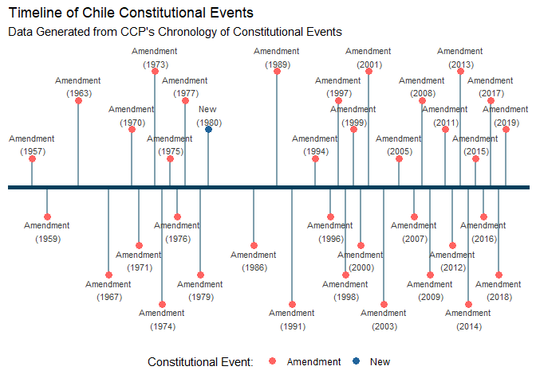

<!-- README.md is generated from README.Rmd. Please edit that file -->


# demcon

<!-- badges: start -->
<!-- badges: end -->

**demcon** is designed to provide researchers and practitioners with
*brief* literature reviews and programmatic access to several popular
polity, democratic, institutional, and constitutional datasets. This
package provides comparative context to the datasets in addition to
documented functions that help users acquire, process, and visualize
widely used political science datasets.

**demcon** was developed as part of the DANTE Project, which is led by
[ISciences LLC](https://www.isciences.com/) in partnership with the
[Center for International Earth Science Information Network
(CIESIN)](https://www.ciesin.columbia.edu/), and CASE Consultants
International. This project was made possible by generous support from
the [U.S. Army Engineer Research and Development Center
(ERDC)](https://www.erdc.usace.army.mil/). DANTE is an open science
platform designed to increase accessibility to and accelerate the
interdisciplinary study of environmental stresses, demographics,
economics, health, political instability, and humanitarian response. The
platform is designed to be inclusive and welcomes contributions from
environment-security students, scholars, and practitioners worldwide.

## Installation

You can install the released version of **demcon** from DANTE’s GitLab
project.

``` r
devtools::install_gitlab("dante-sttr/demcon")
```

For more detailed information visit the [**demcon** package
website](https://dante-sttr.gitlab.io/demcon/index.html).

## Support

**demcon** currently provides brief review or programmatic support for
several political datasets:

-   Varieties of Democracy
-   Polity5
-   Freedom House’s Freedom in the World
-   Database of Political Institutions
-   The Economists’ Democracy Index
-   Institutions and Elections Project
-   Comparative Constitution Project:
    -   Characteristics of National Constitutions
    -   Chronology of Constitutional Events
    -   Constitute
-   **cshapes**

## Using demcon

Currently, **demcon** can be used to acquire, process, and visualize
select number of political datasets.

### Acquiring Data

Download Polity5, load into the local environment, and delete the
downloaded `.zip` file.

``` r
polity<-demcon::get_polity5(load = TRUE, del_file = TRUE)

head(polity)
#> # A tibble: 6 × 37
#>   p5    cyear ccode scode country year  flag  fragm…¹ democ autoc polity polity2
#>   <chr> <chr> <chr> <chr> <chr>   <chr> <chr> <chr>   <chr> <chr> <chr>  <chr>  
#> 1 0     7001… 700   AFG   Afghan… 1800  0     <NA>    1     7     -6     -6     
#> 2 0     7001… 700   AFG   Afghan… 1801  0     <NA>    1     7     -6     -6     
#> 3 0     7001… 700   AFG   Afghan… 1802  0     <NA>    1     7     -6     -6     
#> 4 0     7001… 700   AFG   Afghan… 1803  0     <NA>    1     7     -6     -6     
#> 5 0     7001… 700   AFG   Afghan… 1804  0     <NA>    1     7     -6     -6     
#> 6 0     7001… 700   AFG   Afghan… 1805  0     <NA>    1     7     -6     -6     
#> # … with 25 more variables: durable <chr>, xrreg <chr>, xrcomp <chr>,
#> #   xropen <chr>, xconst <chr>, parreg <chr>, parcomp <chr>, exrec <chr>,
#> #   exconst <chr>, polcomp <chr>, prior <chr>, emonth <chr>, eday <chr>,
#> #   eyear <chr>, eprec <chr>, interim <chr>, bmonth <chr>, bday <chr>,
#> #   byear <chr>, bprec <chr>, post <chr>, change <chr>, d5 <chr>, sf <chr>,
#> #   regtrans <chr>, and abbreviated variable name ¹​fragment
#> # ℹ Use `colnames()` to see all variable names
```

### Processing Data

**demcon** provides functions that automates common processing tasks for
political science datasets. In this quick example we load Varieties of
Democracy (V12) and use `demcon::prep_vdem()` to select indicators of
interest, index the data to only Correlates of War country-years, drop
Palestinian observations, and average values for Serbia and Kosovo (\<
2008) and the State Union of Serbia and Montenegro (2003-2006).

``` r
vdem<-demcon::get_vdem()

vdem<-demcon::prep_vdem(vdem, 
                        cow_index = TRUE, 
                        drop_pal = TRUE,
                        srb_kos = TRUE, 
                        srb_mon = TRUE)
```

### Visualizing Data

**demcon** can help you visualize political datasets. In this example we
plot we plot constitutional changes in Chile from 1950 to present day.

``` r
cce<-demcon::get_cce()

cce<-demcon::prep_cce(cce, evnttype_fix = TRUE)

plot(cce, cntry = "Chile", years = c(1950, 2022))
```



### Reference Materials

**demcon** also provides short vignettes that help users acquaint
themselves with key constitutional datasets and analytic techniques.
These include:

-   [A Brief Review of Constitutional
    Datasets](https://dante-sttr.gitlab.io/demcon/articles/constitution-datasets.html)
-   [A Brief Review of Democratic and Authoritarian
    Datasets](https://dante-sttr.gitlab.io/demcon/articles/dem-datasets.html)
-   [Pre-Processing the Varieties of Democracy
    Dataset](https://dante-sttr.gitlab.io/demcon/articles/clean-vdem.html)
-   [Calculating Executive Constraints
    Indices](https://dante-sttr.gitlab.io/demcon/articles/constraint-indices.html)
-   [Country Coding Considerations for Dataset Harmonization and Applied
    Uses](https://dante-sttr.gitlab.io/demcon/articles/ccode-considerations.html)
