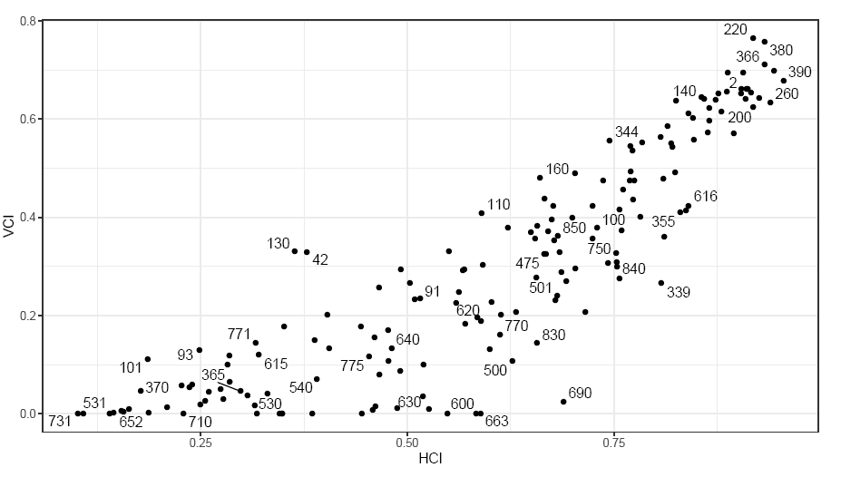

```{r, include = FALSE}
knitr::opts_chunk$set(
  collapse = TRUE,
  comment = "#>"
)
```

```{r setup, echo=FALSE}
library(demcon)

col1<-"#11d5ff"
col2<-"#0b3d91"
col3<-"#f1bd57"
col4<-"#fc7f20"
grey<-"#666666"
```

## Introduction

Assessing a nation-state's stability and risk of civil war or failure is one of the largest sub-disciplines for researchers and practitioners of political science and international relations. Despite decades of research, there is no widespread agreement over the relationship between institutional structure and the risk of state failure [@Jones2018]. Further, there's still considerable debate over which metrics are best to simply characterize state institutions [@Casper2003].

One of the prevailing theories for many years is that partial democracies or autocracies (neither fully democratic or fully autocratic) and newly instituted regimes are the most likely to devolve into civil war. This theory is mostly supported by statistical models that utilize composite indices designed to measure institutional levels of democracy and autocracy. Several studies have shown a relationship between countries that "exist in the middle" of composite measures of democracy and state failure or civil war, but recent criticism has called this relationship into question. It's been hypothesized that models select for the quadratic relationship of composite measures of democracy, because it's a catch-all for every possible institutional measure (i.e. individual metrics for regimes in the middle can be as democratic or as authoritarian as pure democracies and pure autocracies) [@Fjelde2021]. So while this increases model skill, it does not increase causal understanding.

The most popular long-standing composite index is the The Center for Systemic Peaces' Polity scale [@Marshall2020]. Although it reigned supreme over research throughout the 1990s-2010s, it has since fallen out of favor with some, because it suffers from a lack of methodological transparency [@Lindberg2014]. Moreover, it is particularly susceptible to the aforementioned problem where regimes with similar positions on the Polity Scale have dramatically different regime characteristics [@Treier2008]. The Varieties of Democracy dataset (V-Dem) was developed in response to several of the criticisms levied on Polity; foremost being their commitment to transparency in their methods [@Lindberg2014]. The V-Dem V11.1 dataset contains more than 400 measures of democracy and authoritarianism, including 5 high level composite indices [@Coppedge2021a]. Although these composite indices appear to be less ambiguous in their institutional characterizations, they still may be too generalized to identify specific institutional configurations that result in instability or civil war.

In light of these concerns, [@Fjelde2021] developed 2 new, more narrowly focused, indices to better identify institutions at risk for civil war in their recent publication entitled [*Which Institutions Matter? Re-Considering the Democratic Civil Peace*](https://doi.org/10.1093/isq/sqaa076). They named the indices the Horizontal Constraints Index (HCI) and the Vertical Constraints Index (VCI). Their results found that the HCI and VCI were statistically significant predictors of civil peace. I became very interested in these, more narrow, composite indices after struggling to find strong statistical relationships between various forms of conflict or state failure in my own research. Therefore, I hope this guide might make their use and conceptual design more accessible and encourage you to use them in your own research. In this vignette I walk through generating the indices using the *demcon* package, but in a future installment I hope to demonstrate the GAM modeling approach used in the featured manuscript for those of you who want to learn how to employ recent high impact applied modeling.

## The Indices

### HCI

Horizontal constraints represent checks and balances on centralized executive power. These include constraints put in place by executive and judicial branches of government. Horizontal constraints mainly serve the interests of non-governmental elites by protecting their interests against an uncontrolled executive. In contrast to the VCI, HCI is a simple arithmetic mean of V-Dem's legislative constraints (*v2xlg_legcon*) and judicial constraints variables (*v2x_jucon*). The HCI is defined as:

$$HCI = \frac{v2xlg_legcon + v2x_jucon}{2}$$

The methods behind the VCI are more complicated.

### VCI

The VCI represent civil liberties attributed to the general populace the constrain executive actions. These include suffrage, the presence of elections that appoint executive officials, freedom of association, freedom of expression, and the presence of clean and fair elections.

At it's core, VCI is a multiplicative aggregation of 5 V-Dem variables designed to measure suffrage, elected officials, freedom of association, freedom of expression and clean elections (*v2x_suffr*, *v2x_accex*, *v2x_frassoc_thick*, *v2x_freexp_thick*, *v2xel_frefair*). However, the final component (*v2xel_frefair*) is a composite index developed with a Bayesian factor analysis of 8 other V-Dem indicators (*v2elembaut*, *v2elembcap*, *v2elrgstry*, *v2elvotbuy*, *v2elirreg*, *v2elintim*, *v2elpeace*, *v2elfrfair*), of which, the authors adapted by purging 2 of the components representing government intimidation or violent actions (*v2elintim*, *v2elpeace*). This was done to prevent potential endogeneity in their regressions for the onset of conflict; i.e. you don't want to predict the onset of conflict with and independent variable that is, in-part, composed of measures of conflict.

Although the original *v2xel_frefair* composite index was developed using V-Dem's Bayesian Factor Measurement Model [@Pemstein2018a], the VCI adapted for this study took a simpler approach. In footnote 12, the authors state that the modified composite index was created by averaging the 6 non-violent indicators of *v2xel_frefair* (*v2elembaut*, *v2elembcap*, *v2elrgstry*, *v2elvotbuy*, *v2elirreg*, *v2elfrfair*). Although not explicitly stated, zit's presumed that the average for these 6 indicators was converted to the final 0-1 interval scale using "...the cumulative distribution function of the normal distribution". This is the standard V-Dem procedure for their 0-1 interval indices as stated on page 7 of the V-Dem V11.1 Methodology handbook [@Coppedge2021b]. The VCI is defined as:

$$ VCI = v2x_suffr \times v2xaccex \times v2xfrassocthick \times v2xfreexpthick \times \overline{v2xelfrefair}$$

$$\overline{v2xel_frefair} = \frac{v2elembaut+v2elembcap+v2elrgstry+v2elvotbuy+v2elirreg+v2elfrfair}{6}$$

Lastly, the VCI constructed for their manuscript was carried out using the V-Dem 7.1 dataset. Since that time (current version is V11.1), 2 of the indicators used in the VCI calculation have been renamed and slightly altered [@Coppedge2021a]:

1.  *v2x_freexp_thick* was converted to *v2x_freexp_altinf* starting with version 11. The sub-components of this composite index were altered slightly, but they still encompass the same concepts of censorship in media.

2.  *v2x_accex* was renamed *v2x_elecoff* starting with version 8. This was due to changes in the aggregation method for calculating the composite index. Although the conceptual design for the composite indicator has not changed, the aggregation formula is more complex and consists of 20 indicators (opposed to 10 for the original *v2x_accex*).

## Accessing the Indices

You can access VCI and HCI with the **demcon** in 2 ways:

1.  Using an adapted version from the manuscript replication package that is embedded in **demcon** and available with a call to `vdem::vdem_vci_hci`.
2.  Using the `demcon::vci()` and `demcon::hci()` functions to calculate the indices with your own data.

### Using the Embedded Package Data

Unlike many peer reviewed manuscripts, the data and code used to produce the analysis for *Which Institutions Matter? Re-Considering the Democratic Civil Peace* is available online. The data is available inside of the manuscript's replication package, which can be download from the [supplementary materials section](https://academic.oup.com/isq/article/65/1/223/5990223#supplementary-data) of the manuscript's homepage. Although the full replication dataset contains all variables used for their analysis, I performed some pre-processing on the data to create a simplified version. You can load the pre-processed dataset locally with a call to `demcon::vdem_vci_hci.`

```{r}
hci.vci<-demcon::vdem_vci_hci

head(hci.vci)
```

The dataset is comprised of `r dim(demcon::vdem_vci_hci)[1]` country-year observations and `r dim(demcon::vdem_vci_hci)[2]` variables:

-   `country_name` : The common country name.

-   `gwno` : The Gleditsch and Ward numeric country code.

-   `cowcode` : The Correlates of War numeric country code.

-   `year` The observation year.

-   `hci` The horizontal constraint index.

-   `vci` The vertical constraint index.

The raw replication data only contains Gleditsch and Ward country identifiers, while the actual V-Dem dataset only contains numeric V-Dem and Correlates of War (CoW) country codes. Therefore, I introduced the common country names and CoW codes so there would be an easy common key to join the constraint indices back to other V-Dem data. To see a full list of the pre-processing steps used prior to embedding the data in **demcon** please review the [`vdem_vci_hci.R` script](https://gitlab.com/dante-sttr/demcon/-/blob/master/data-raw/vdem_vci_hci.R).

If you would like to work directly with the full replication dataset, it can be accessed programmatically with the following code:

```{r message=FALSE, warning=FALSE, eval=FALSE}

rep_url<-"https://oup.silverchair-cdn.com/oup/backfile/Content_public/Journal/isq/65/1/10.1093_isq_sqaa076/1/sqaa076_replication.zip?Expires=1654268815&Signature=4ZvswA2nYP2nPWE-wx0T~oFTqwMB2O6n~1Z2qgdhrpz7fE4OFpkdbwVhk5bMQMx9dM12TX0U3N663k2DC1NnkTyrsdDJV9P8jR1fo8xTgGvXNsico2EXgRTNJ034y-oFqAY2PmGzpe4B1ZrQpPKgAqWjlxoBTjb3RbSuKu4dJxQjiRKF4~2BzSbIkTm25DBk9TVsmVcMHnAs6nzklMx2L7Mfq4k17OKEAapwXAZz6tyTgzhVoLdNDjY1sPYCnTHWsyMBwt4MqntiAP~uFVvYs0r6weGocpMZBJ1PFK35XinYaRw~hiwnWa7sl7HxqLQUvBa1Q8wMFVq02zWSUvZCsA__&Key-Pair-Id=APKAIE5G5CRDK6RD3PGA"

if(!file.exists("institutions.csv")) {
  httr::GET(url = rep_url,
            httr::write_disk("sqaa076_replication.zip", overwrite = TRUE))
  
  utils::unzip(zipfile = "sqaa076_replication.zip",
               files = "ReplicationPackage/Data/institutions.csv")
}
```

For the purposes of this vignette I've already prepared the download.

```{r}

full_rep_data<-data.table::fread("institutions.csv")

```

The replication data contains a YAML file (`vnames.yaml`) with a few variable descriptions, but it's not very helpful. In my experience, most of the time you can actually access replication data for a published manuscript, it's quite difficult to parse. Through trial and error, and using Figure A-1 (page 5) of the supplementary materials appendix, I was able to verify the proper indices by replicating the plot. In the raw dataset, `horizontal_constraint` is the HCI and `free_fair_elections` is the VCI.

Here is the figure from the supplementary materials.

```{r echo=FALSE, fig.width=7.5, fig.height=5, fig.cap="Horizontal and Vertical Constraint indices for the year 2015. Numeric codes represent Gledistch and Ward numeric codes. Adapted from figure A-1 of the supplementary materials."}

```

Here is the verification figure using `horizontal_constraint` as the HCI and `free_fair_elections` as the VCI.

```{r echo=FALSE, fig.width=7.5, fig.height=5, fig.cap="Horizontal and Vertical Constraint indices for the year 2015 created from the replication package data."}
 ggplot2::ggplot(full_rep_data[year==2015],
                 ggplot2::aes(x = horizontal_constraint, 
                              y = free_fair_elections))+
   ggplot2::geom_point(size = 2, color = col2)+
   ggplot2::geom_text(label=full_rep_data[year==2015,gwno],
                      nudge_x = 0.02, nudge_y = 0.01)+
   ggplot2::labs(x = "HCI", y ="VCI")+
   ggplot2::theme_minimal()

```

The embedded data is an easy way to quickly look up values for countries of interest or get a sense of how the data is distributed, although there is a significant drawback; it terminates in 2016. Moreover, most countries are quite erratic in their time-series so you can't extend the time-series with a simple imputation or linear extrapolation. The indices are all over the place for the handful of countries I randomly selected.

```{r echo = FALSE, fig.width=7.5, fig.height=5, fig.cap = "Horizontal and Vertical Constraint indices over time for select countries created using the replication data."}
data.table::setDT(hci.vci)
plot_hci_vci<-data.table::melt(hci.vci, id.vars = c("cowcode", "country_name","year"), measure.vars = c("vci", "hci"), value = "value", variable = "constraint")
countries<-c("France", "Chad", "Nigeria", "Argentina", "Mexico", "China")

plot_hci_vci<-plot_hci_vci[country_name %in% countries][constraint=="vci", constraint:="VCI"][constraint=="hci", constraint:="HCI"]

 ggplot2::ggplot(plot_hci_vci,
                 ggplot2::aes(x = year, 
                              y = value,
                              color = constraint))+
   ggplot2::geom_line(size = 1.5)+
   ggplot2::labs(x = "", y ="", color = "Constraint")+
   ggplot2::facet_wrap(~country_name)+
   ggplot2::scale_color_manual(values = c(col2,col1))+
   ggplot2::theme_minimal()+
   ggplot2::theme(legend.position = "bottom")
```

### Using demcon Functions

You can also calculate the indices using the `demcon::vci()` and `demcon::hci()` functions. Although neither of the indices are complicated calculations, developing and properly documenting custom functions provides some benefits. They make it easier to quickly generate the indices alongside other data in your analysis, and provides a help file with reference materials and links so you can share it with colleagues and get a quick refresher on the origins of the indices.

#### Getting V-Dem Data

You can acquire the latest version of V-Dem using the **vdemdata** package [@V-DemInstitute2020]. It is not available on CRAN, but the latest version can be installed directly from GitHub using the **devtools** package. If you don't want to use a non-standard package (not on CRAN or Bioconductor), you can use **demcon**'s wrapper to download it directly from their GitHub site.

```{r eval=FALSE}
devtools::install_github("vdeminstitute/vdemdata")
```

The data is bundled in the package as an embedded object. The dataset contains more than 4000 variables stretching backwards to the year 1789, so we'll start by subsetting it to a more manageable selection. We'll just take everything we need to create the indices and some identification variables starting in 1970.

```{r}
# vdem_raw<-vdemdata::vdem

vdem_raw<-demcon::get_vdem(write_out = FALSE)
data.table::setDT(vdem_raw)

  id_vars <- c("country_text_id", "COWcode", "year")

  frefair_components <-
    c('v2elembaut',
      'v2elembcap',
      'v2elrgstry',
      'v2elvotbuy',
      'v2elirreg',
      'v2elfrfair')

  vci_components <-
    c('v2x_suffr',
      'v2x_elecoff',
      'v2x_frassoc_thick',
      'v2x_freexp_altinf')
  
  hci_components <- c('v2xlg_legcon', 'v2x_jucon')

keeps<-c(id_vars, frefair_components, vci_components, hci_components)
  
vdem_sub<-vdem_raw[year>=1970, ..keeps]
```

```{r include=FALSE}
rm(vdem_raw)
gc()
```

#### HCI

The HCI is a simple average of legislative (`v2xlg_legcon`) and judicial (`v2x_jucon`) constraints. Using `demcon::hci()` you can create a vector of HCI scores or append it to existing data. Because the 2 components that make up HCI are already scaled to a 0-1 interval the output HCI vector will also be on a 0-1 interval.

```{r}
hci<-demcon::hci(vdem_sub, append = FALSE)
```

As you can see, `demcon::hci()` and `demcon::vci()` will remind you that any input observations with an `NA` will produce an `NA` for the constraint index. The HCI scores are uniformly distributed.

```{r echo=FALSE, fig.height=5, fig.width=7.5, message=FALSE, warning=FALSE}
ggplot2::ggplot()+
  ggplot2::geom_histogram(ggplot2::aes(hci), fill = col1, color = col2, binwidth = 0.05)+
  ggplot2::labs(y = "Count", x = "HCI")+
  ggplot2::theme_minimal()
```

To append the new variable to the input dataset specify `append = TRUE`. The new variable is aptly named `hci`.

```{r}
hci<-demcon::hci(vdem_sub, append = TRUE)
names(hci)
```

#### VCI

The `demcon::vci()` function behaves similarly as the HCI function with the ability to return a vector of scores, or the input dataset with the VCI as a new variable.

Both the VCI and HCI functions will also produce an error if one of the required input variables is not present in the input `data.frame`.

```{r error = TRUE}
id_vars <- c("country_text_id", "COWcode", "year")

  frefair_components_missing <-
    c('v2elembaut',
      'v2elembcap',
      'v2elrgstry',
      'v2elvotbuy')

  vci_components_missing <-
    c('v2x_suffr',
      'v2x_elecoff',
      'v2x_frassoc_thick')
  
keeps<-c(id_vars, frefair_components_missing, vci_components_missing)
  
vdem_sub_missing<-data.table::copy(vdem_sub[, ..keeps])

vdem_sub_missing<-demcon::vci(vdem_sub_missing)
```

```{r include=FALSE}
rm(vdem_sub_missing)
gc()
```


The `demcon::vci()` function carries out 3 individual steps.

1.  Calculates the modified clean elections composite index (`v2xelfrefair`) with the violence components purged. This is a simple average of the 6 non-violent components.
2.  Scales the modified clean elections composite index (`v2xelfrefair`) to 0-1 using the cumulative probability function of the normal distribution. This is carried out by `demcon::range01()`.
3.  Calculates VCI by taking the product of the 5 sub-components representing suffrage, elected officials, freedom of association, freedom of expression, and modified clean elections.

If you specify `append = FALSE`, the function will produce a numeric vector of VCI values (just as with `demcon::hci()`). If you specify `append = TRUE`, `demcon::vci()` will return the VCI (`vci`) and the intermediary adjusted clean elections index with the violent sub-indicators purged (`v2xel_frefair_adj`).

```{r}
hci<-demcon::vci(hci, append = TRUE)
data.table::setDT(hci)
names(hci)
```

The VCI is a multiplicative index; meaning, each individual component (all scaled 0-1), are multiplied against one another to create a 0-1 composite VCI score. Theoretically, this is plausible because constraints of the population at large on the executive branch are dependent upon the full chain of civil liberties to be fully operational. If one component breaks down the entire chain of accountability breaks down. Remember that:

$$VCI = suffrage \times elected officials \times freedom assoc \times freedom exp \times clean elections$$ If any one of these components is not in place (the score approaches 0), the entire VCI index will approach 0. This is important conceptually, because you can not have vertical constraints on the executive with suffrage and no elected officials, or suffrage and elected officials, but no clean elections. For this reason, the VCI values follow more of a gamma distribution with many country-years observations bound up against 0. If you were to model VCI as the dependent variable you would likely need to take some alternative approach like a zero-inflated, hurdle, or mixture model.

```{r echo=FALSE, fig.width=7.5, fig.height=5, message=FALSE, warning=FALSE}
ggplot2::ggplot()+
  ggplot2::geom_histogram(ggplot2::aes(hci$vci), fill = col2, color = col1, binwidth = 0.05)+
  ggplot2::labs(y = "Count", x = "VCI")+
  ggplot2::theme_minimal()
```

### Visualizing the Scores

We can map the scores and do a little visual check of our calculations by merging them with a global shapefile. There are a lot of ways to get global vectorized boundaries; I prefer the **rnaturalearth** [@South2021] package for an open source solution.

```{r fig.width=7.5, fig.height=5, echo = FALSE}
global<-rnaturalearth::ne_countries(returnclass = 'sf', scale = 'medium')
global$cow<-countrycode::countrycode(global$iso_a3, origin = "iso3c", destination = "cown")
global<-merge(
  global, hci[year==2020],
  by.x = "cow", by="COWcode", all.x = TRUE
)

# plot(global[, "vci"], graticule = TRUE, key.pos = 1, axes = TRUE, key.width = lcm(1.3), key.length = 1.0)

```

First the VCI wrapped up in a nicer `ggplot` map.

```{r fig.height=5, fig.width=7.5, echo = FALSE}
ggplot2::ggplot(global)+
  ggplot2::geom_sf(ggplot2::aes(fill = vci), size = 0.0000001)+
  ggplot2::labs(title = "Global VCI Estimates for 2020",
                subtitle = "Using V-Dem V11.1 and the demcon Package",
                fill = "VCI")+
  ggplot2::scale_fill_gradient(low = col2, high = col1)+
  ggplot2::theme_minimal()
```

And now the HCI.

```{r fig.height=5, fig.width=7.5, echo=FALSE}
ggplot2::ggplot(global)+
  ggplot2::geom_sf(ggplot2::aes(fill = hci), size = 0.0000001)+
  ggplot2::labs(title = "Global HCI Estimates for 2020",
                subtitle = "Using V-Dem V11.1 and the demcon Package",
                fill = "HCI")+
  ggplot2::scale_fill_gradient(low = col2, high = col1)+
  ggplot2::theme_minimal()
```

These estimates seem reasonable. The greatest constraints on the executive are in Canada, Australia, and throughout Western Europe, while most of Africa, the Middle East, and South Asia all have severe limitations. It's also not surprising that although the relative patterns between VCI and HCI are similar, constraints from fellow elites (HCI) are more common than constraints from the general public throughout the globe.

## Conclusion

This concludes our brief review of VCI and HCI indices. If you'd like to learn more about datasets featuring composite indicators for levels of democracy and authoritarianism, please check out **demcon**'s *A Brief Review of Democratic and Authoritarian Datasets* vignette. I also encourage you to check out the full [*Which Institutions Matter? Re-Considering the Democratic Civil Peace*](https://doi.org/10.1093/isq/sqaa076) manuscript, or the Democracy Week 2021 webinar that featured a session discussing the results of this paper and other recent research using V-Dem indicators.

